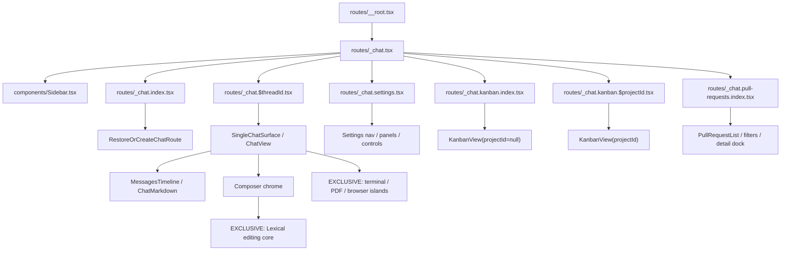

# P5-R1 interface and reuse audit

Date: 2026-07-27
Scope: current packaged slice compared with Synara Web source and the first side-by-side evidence.

## Anti-patterns verdict

**Fail — the slice reads as a generic reconstructed admin UI, not as a Synara port.**

Specific tells:

- The product invents a logo block, brand header, identity footer and generic primary navigation
  instead of preserving Web’s compact Studio/Projects segmented shell
  (`slice/src/components/sidebar/Sidebar.lynx.tsx:49-96,155-172`).
- The invented Projects page uses the repeated “icon tile + title + metadata” card-grid template
  (`slice/src/app/FeatureListsPage.tsx:26-75`, `App.css:257-312`); Web has no `/projects` route.
- The product header exposes `ports / ui / markdown / settings` diagnostic links in the packaged
  app. This is scaffold navigation, not product information architecture.
- Threads are rendered as large full-width bordered cards, while Web’s landing is a compact
  sidebar plus centered new-chat composition surface. The visual hierarchy is therefore a
  different application, even though the data is real.

There is no gradient/glass/neon “AI palette” problem. The failure is structural: safe generic
cards and invented chrome replaced an existing, more specific interface.

## Executive summary

- Findings: **2 critical, 5 high, 4 medium, 3 low**.
- Current eligible TS/TSX source reuse is **0% on all six screens**. This is mechanically proven
  by `p5-r1-reuse-baseline.json`; shared CSS tokens and generated assets intentionally do not
  inflate the source metric.
- The most consequential issues are clean-room screen composition, incorrect route/reference
  mapping for Projects, and missing theme/interaction semantics.
- Overall migration fidelity: **28/100**. Runtime/data foundations are strong; visual and
  interaction identity are not yet a port.
- Immediate next step: P5-R2 must compile a real Web subtree by physical source identity before
  adding any more screen-specific Lynx JSX.

## Six-screen dependency map

| Screen ID | Authoritative Web route | Web feature entry | Current slice counterpart | Audit verdict |
|---|---|---|---|---|
| threads | `/` | `_chat.index.tsx` under root/chat shell | router + Sidebar + full-page cards | clean-room; wrong landing anatomy |
| thread | `/$threadId` | `_chat.$threadId.tsx` → SingleChatSurface | Transcript + Composer | real data, different component tree |
| settings | `/settings` | `_chat.settings.tsx` | SettingsPage | clean-room subset and copy |
| projects | `/kanban/` | `_chat.kanban.index.tsx` → KanbanView(null) | `/projects` FeatureListsPage | incorrect route/reference mapping |
| kanban | `/kanban/$projectId` | `_chat.kanban.$projectId.tsx` | `/kanban` FeatureListsPage | global thread projection, not project board |
| pull-requests | `/pull-requests/` | `_chat.pull-requests.index.tsx` | PullRequestsPage | clean-room list, missing filters/detail dock |

The generated JSON contains every reachable module, dependency edge, target
SHARED/PATCHED/SPLIT/EXCLUSIVE classification and reason.

## Detailed findings by severity

### Critical

#### C1 — Six screen renderers have zero physical source reuse

- Location: all configured Web route graphs and `slice/src/app`.
- Category: Maintainability / Fidelity.
- Evidence: Threads 296 eligible modules, Thread 559, Settings 339, Projects/Kanban 377,
  Pull Requests 372; reused module and LOC numerator is zero for each.
- Impact: every upstream structure/copy/token/interaction change must be manually rediscovered;
  visual convergence will regress continuously even if one screenshot is polished.
- Recommendation: P5-R2 compiler probe must import the same Web file, then push incompatibility
  down to adapters. Do not count same-name copies.

#### C2 — Projects uses a nonexistent Web product route

- Location: `Sidebar.lynx.tsx:77-85`, `FeatureListsPage.tsx:26-75`.
- Category: Information architecture / Fidelity.
- Evidence: Web route tree exposes `/kanban/` overview and `/kanban/$projectId`; there is no
  `/projects`. Slice invents `/projects` and a generic project tile grid.
- Impact: visual comparison cannot succeed because the two sides are different screens.
- Recommendation: define Projects certification against Web `/kanban/` and retain project-scoped
  Kanban as `/kanban/$projectId`.

### High

#### H1 — Packaged navigation exposes development harnesses

- Location: packaged screenshot `shots/2026-07-27/p4-x3/packaged-smoke.png`; slice router header.
- Category: Information architecture.
- Impact: users see implementation diagnostics as primary product navigation; header geometry
  also prevents matching every Web route.
- Recommendation: preserve diagnostics as explicit dev-only routes and remove them from product
  composition in P6/P8.

#### H2 — Dark theme is known incomplete

- Location: `slice/src/app/App.css:1-7`, `SettingsPage.tsx:207-218`.
- Category: Theming.
- Evidence: dark `@variant` handling is described as inert/pending; settings only previews
  swatches.
- Impact: half of the Phase 8 matrix cannot currently meet semantic surface/selection/focus
  parity, and contrast cannot be certified.
- Standard: WCAG 1.4.3/1.4.11 must be checked after token mapping.
- Recommendation: P5-R4 must produce concrete Lynx light/dark semantic values from one source.

#### H3 — Custom tap surfaces lack keyboard/accessibility contracts

- Location: `Sidebar.lynx.tsx:51-60,65-95,111-147,155-172`;
  `SettingsPage.tsx:71-81,111-137`.
- Category: Accessibility / Interaction.
- Evidence: interactive `<view bindtap>` surfaces have no recorded role, accessible label,
  selected/expanded state or keyboard path.
- Impact: desktop keyboard users and assistive technology cannot reliably identify or activate
  navigation, disclosure and switches.
- Standard: WCAG 2.1.1, 2.4.7, 4.1.2.
- Recommendation: define shared primitive semantics in P5-R3 and verify Tab/Enter/Escape in P7.

#### H4 — Core visual anatomy differs, not just styling

- Location: `App.css:32-98,208-312`; first side-by-side notes for sidebar/chat/settings.
- Category: Fidelity / Responsive.
- Impact: changing colors and spacing cannot converge a full-width card list to Web’s compact
  shell, transcript surface and composer. Pixel tuning the slice would deepen duplication.
- Recommendation: replace composition through shared source in Phase 6; do not polish these
  clean-room structures.

#### H5 — Interaction states are absent or silently reduced

- Location: Sidebar/Settings custom rows; compat matrix `:hover`, focus-visible, overlay entries.
- Category: Accessibility / Interaction.
- Impact: pointer affordance, focus location, disabled state and overlay dismissal differ from
  the learned Web model.
- Recommendation: keep static parity work separate from P7’s explicit state matrix; no broad
  exemption for “Lynx has no pseudo-class” is allowed when state classes can implement it.

### Medium

#### M1 — Slice queries duplicate the Web state architecture

- Location: Sidebar polling every 5s; Kanban every 2s; PR every 60s.
- Category: Performance / Reliability.
- Impact: multiple screens poll overlapping snapshot data, can display temporally inconsistent
  counts, and bypass Web’s normalized store/event projection.
- Recommendation: P5-R2/P6 should reuse the shared state/subscription surface; keep Lynx transport
  behind the port.

#### M2 — Fixed sidebar and tile geometry is unverified at contract sizes

- Location: `sidebar.css:1-9` (`308px`); `App.css:257-282` (`31%`, fixed tile anatomy).
- Category: Responsive.
- Impact: current screenshot is 2560px wide, while required certification is 1280×820 and
  1440×900. Density and content width may diverge or overflow.
- Recommendation: measure the Web anchors at both sizes before choosing Lynx constants.

#### M3 — Invented copy and identity create content mismatches

- Location: “Local workspace / Connected”, “WORKSPACES”, “CONTROL CENTER”, custom explanatory
  subtitles in Sidebar and FeatureListsPage.
- Category: UX Writing / Fidelity.
- Impact: even visually similar layouts fail content parity and communicate functionality the
  Web app does not present in those locations.
- Recommendation: use Web strings/components; platform-only status must have a documented product
  reason.

#### M4 — Hard-island boundary is too coarse around ChatView

- Location: target graph marks `ChatView.browser.tsx` SPLIT at 5,849 LOC while composer,
  transcript and environment chrome are mixed inside it.
- Category: Maintainability.
- Impact: treating the entire file as platform-specific would cap reuse well below target and
  recreate the clean-room failure at a larger scale.
- Recommendation: P5/P6 must extract/share outer composition and keep only terminal/PDF/browser/
  editing kernels exclusive.

### Low

#### L1 — Native/glyph icon sources are mixed

- Location: Sidebar uses generated SVG for some items and text glyphs `▦`, `⑂`, `↻`, `⚙`.
- Category: Theming / Fidelity.
- Impact: weight, baseline and color rendering vary by platform/font.
- Recommendation: use the deterministic shared icon manifest.

#### L2 — Small controls are below general touch-target guidance

- Location: sidebar project headers 29px, nav/search 34px.
- Category: Accessibility.
- Impact: reduced motor accessibility if this UI is later used on touch hosts.
- Standard: WCAG 2.5.8 target-size guidance.
- Recommendation: preserve compact desktop density while documenting or adapting the touch-host
  variant; do not blindly force 44px on the desktop reference.

#### L3 — Production React tree inspection is unavailable

- Location: P4-X3 production bundle.
- Category: Diagnostics.
- Impact: component-level runtime evidence cannot be collected from production Preact DevTools.
- Recommendation: retain the explicit, default-off package diagnostic switch and rely on source
  graph + Lynx element screenshot/console for certification.

## Patterns and systemic issues

1. **Architecture before pixels**: the dominant fidelity failures originate in duplicated
   composition, not isolated CSS values.
2. **Shared tokens without shared structure are insufficient**: base colors transfer, but token
   roles and component anatomy do not.
3. **Platform limitations were over-applied**: the absence of DOM justifies primitive/hard-island
   adaptation, not replacing normal feature composition.
4. **Visual baselines lacked a failure threshold**: P2-V7 correctly documented gaps but did not
   make them task blockers; P5 introduces that gate.

## Positive findings

- Real Synara server data already drives threads, messages, projects and PR empty state.
- Storage, socket, clipboard, dialogs, window and updater capabilities are isolated behind proven
  ports.
- Shared Web tokens are imported from one source.
- Sidebar projection, Kanban projection and update comparison have focused tests.
- Existing side-by-side notes are candid about missing anatomy and provide usable historical
  evidence rather than claiming false parity.

## Recommendations by priority

1. **Immediate**: run P5-R2 against Settings or a narrow Threads subtree; require one physical Web
   TSX source in the Lynx bundle before adding adapters.
2. **Short-term**: establish same-API primitives and light/dark style compilation, then activate
   the 70% reuse and fidelity gates.
3. **Medium-term**: migrate the six screens from shared composition and delete their slice
   counterparts only after each replacement is stable.
4. **Long-term**: resolve terminal/PDF/browser/editor hard islands independently; do not allow
   them to reduce ordinary UI reuse.

## Suggested commands for fixes

- Use `/extract` for shared composition and token/variant seams.
- Use `/normalize` after shared component trees render to align semantic tokens and primitives.
- Use `/adapt` for the two required desktop window sizes and any later touch-host variant.
- Use `/harden` for loading/offline/error states after architecture convergence.
- Use `/polish` only after the source-reuse and structural gates pass.
